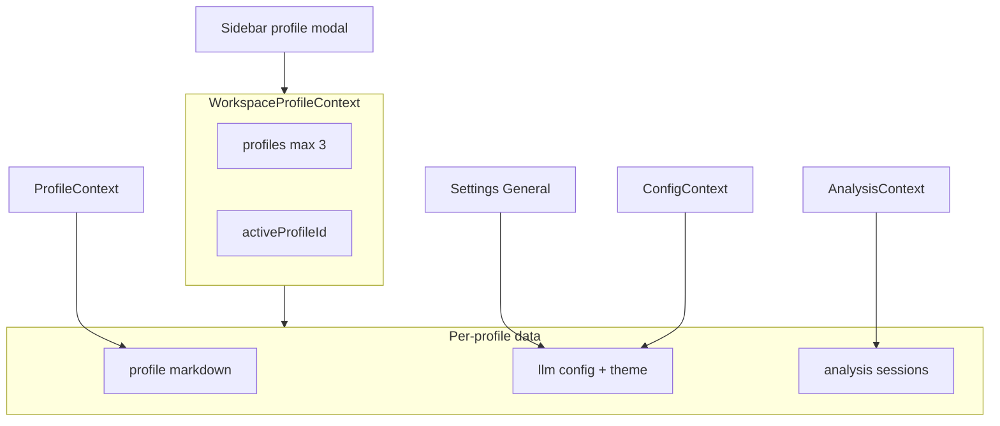

# Artemis Quiver — Development Plan

> **Failsafe:** This file is the canonical implementation plan. Update it as each sprint/task completes so work can resume after a restart. Last synced with active roadmap: May 2026.

## Documentation maintenance

| When | Action |
|------|--------|
| **Before coding** | Ensure this `PLAN.md` reflects the current plan (done at roadmap start). |
| **After each sprint / major task** | Update task checkboxes, “Current status”, and “Suggested order” here. |
| **After full implementation pass** | Sync `README.md` MVP section to match what shipped. |

`Overview.md` was merged into `README.md` and removed.

---

## Project overview

Artemis Quiver is an AI-driven job hunting engine: compare job postings to a master profile, get scoring and tips, then refine CVs and cover letters via interactive builders. Data stays in the browser (`localStorage`) unless exported as Markdown.

**Design:** [Figma — Job Hunting Automation Engine](https://www.figma.com/design/NAKF9BYIvmXKegz6JDnaJl/Job-Hunting-Automation-Engine)

**Stack (actual):** React 18, Vite, Tailwind CSS, shadcn/ui, React Router v7. Local LLM via LMStudio or Ollama (dev proxy).

**Out of scope (this roadmap):** PDF export, cloud API keys, user login/auth.

---

## Current status

| Area | Status |
|------|--------|
| Analysis Hub + `jobAnalysisService` | **Done** — LLM JSON analysis, sessions, `.md` export |
| Profile editor + `ProfileContext` | **Done** — single global profile (workspace split planned) |
| Settings + `llmService` | **Done** — LMStudio/Ollama, connection test |
| Sidebar | **Placeholder** — fake history, inert New Analysis, static footer |
| Settings → General | **Partial** — auto-save only; no theme yet |
| CV / CL builders | **Placeholder** — mock content, `alert()` chat |
| Profile AI tab + file upload | **Stub** |
| Multi-profile workspace | **Planned** |
| Dark theme switcher | **Planned** |

---

## Product flow (vision)

1. User pastes a job posting → app scores match vs profile, estimates salary, gives interview tips.
2. Outputs CV optimization notes + cover letter draft with links to builders.
3. Sidebar shows past analyses (per profile) and profile switcher (up to 3 local profiles, no login).
4. **Profile:** master `.md`, file upload merge, AI assistant chat.
5. **CV / CL builders:** AI generation + chat refinement (Markdown export first; PDF later).
6. **Settings:** LLM provider + General (theme, auto-save) per active profile.

---

## New requirements (active roadmap)

### A. Dark theme switcher

- **Settings → General** (`src/app/pages/Config.tsx`).
- Light / Dark; toggle `dark` on `document.documentElement` (`src/styles/theme.css`).
- Stored per workspace profile with LLM settings.

### B. Multi-profile workspace (no login)

- Max **3** profiles in `localStorage`; each isolates profile markdown, LLM/general settings, analysis sessions, draft posting.
- Metadata: `createdAt`, `lastUsedAt`, `lastModifiedAt`.
- **4th profile** → evict profile with oldest `lastUsedAt` (`console.info`).
- **Migration:** legacy global keys → default “Default” profile on first load.

### C. Sidebar profile modal

- Footer: active name + avatar → modal with 3 profiles (by `lastUsedAt` desc) + **Add profile**.
- Add flow: name prompt → create → switch → `/profile` with edit enabled for import.

---

## Implementation sprints

### Sprint 0 — Workspace profiles + theme

- [ ] `src/app/types/workspace.ts` — types + settings (`theme`, `LlmConfig`)
- [ ] `src/app/context/WorkspaceProfileContext.tsx` — manifest, CRUD, eviction, migration
- [ ] Refactor `ConfigContext`, `ProfileContext`, `AnalysisContext` for per-profile storage
- [ ] Theme switch on General tab; apply on profile switch
- [ ] `ProfileSwitcherModal` + sidebar footer; add-profile → `/profile?edit=1`
- [ ] Legacy `STORAGE_KEYS` migration in `src/app/config/defaults.ts`

### Sprint 1 — Integration glue

- [ ] Sidebar “Recent Analyses” → `AnalysisContext` (scoped per profile)
- [ ] `activeSessionId`; New Analysis clears draft
- [ ] `BuilderHandoffContext` + Analysis Hub → CV/CL builders

### Sprint 2 — Profile features

- [ ] File upload (`.md`, `.txt`) + LLM merge with confirmation
- [ ] Profile AI Assistant tab + per-profile chat history

### Sprint 3 — CV / Cover Letter AI

- [ ] `cvBuilderService` / `clBuilderService`
- [ ] Replace mocks; real chat; Markdown export (not PDF)

### Sprint 4 — Optional polish

- [ ] Follow-up chat on analysis sessions
- [ ] Markdown preview on Profile
- [ ] Final `README.md` sync

---

## Suggested implementation order

1. **Docs:** Keep this `PLAN.md` current; `README.md` updated at start and after ship.
2. Workspace types + context + migration
3. Refactor contexts for per-profile storage
4. Theme + profile modal + new-profile flow
5. Sidebar analysis history + handoff
6. Profile upload + AI chat
7. CV/CL builder AI
8. README final sync

---

## Key files

| Path | Role |
|------|------|
| `src/app/context/WorkspaceProfileContext.tsx` | Multi-profile (new) |
| `src/app/components/workspace/ProfileSwitcherModal.tsx` | Profile modal (new) |
| `src/app/components/navigation/Sidebar.tsx` | History + profile footer |
| `src/app/context/AnalysisContext.tsx` | Job analysis state |
| `src/app/context/ProfileContext.tsx` | Master profile markdown |
| `src/app/context/ConfigContext.tsx` | LLM + general settings |
| `src/app/pages/Config.tsx` | Settings UI |
| `src/app/pages/Profile.tsx` | Profile editor |
| `src/app/pages/AnalysisHub.tsx` | Job analysis UI |
| `src/app/pages/CVBuilder.tsx` / `CLBuilder.tsx` | Builders (stubs) |
| `src/app/services/llmService.ts` | LLM client |
| `src/app/services/jobAnalysisService.ts` | Analysis prompts |
| `src/app/config/defaults.ts` | Storage keys, defaults |

---

## Risks (from product spec)

- **Context overflow** — large uploads; chunk/summarize.
- **Hallucination** — profile merge and builders must not invent experience.
- **Parsing failures** — inconsistent uploads; confirm before apply.
- **Errors** — user-friendly UI; log details for debugging.

---

## Historical note

Earlier phases assumed Next.js + Vercel AI SDK; the shipped app uses **Vite + React** with a custom `llmService`. Job analysis AI is implemented; CV/CL builders and sidebar glue are not.
