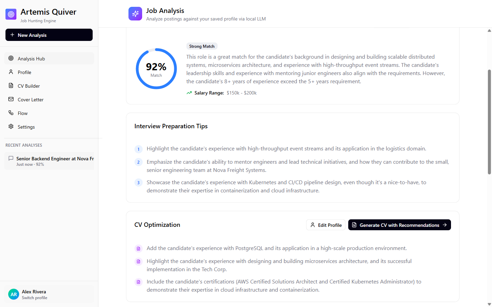
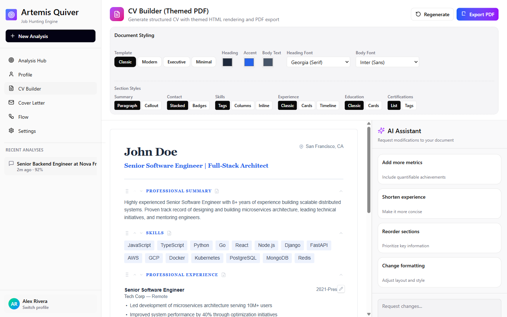
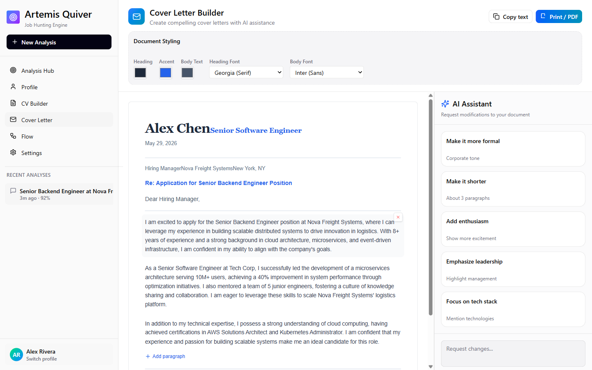
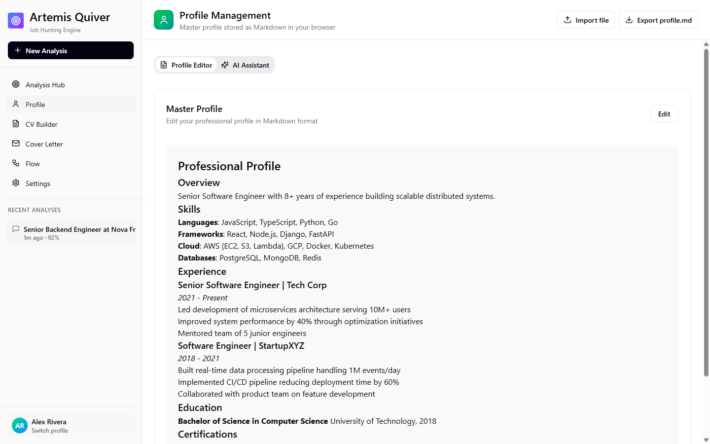
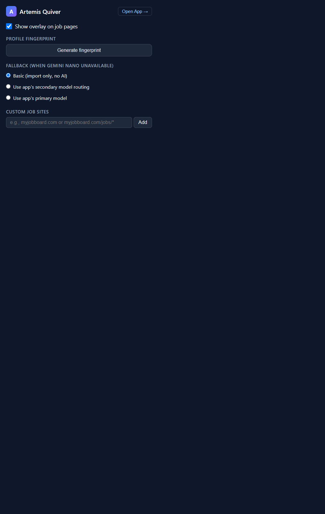

# Artemis Quiver

Score job postings against your own CV, then draft a tailored CV and cover letter — with
the LLM of your choice, cloud or local. No backend, no account: everything is stored in
your browser.

**The Chrome extension is the primary deliverable.** The standalone web app is a
development and fallback surface.

> **Try it**
> Download the latest build from the [Releases](https://github.com/Arthias/Artemis_Quiver/releases)
> page, unzip, then `chrome://extensions` → **Developer mode** → **Load unpacked** → select
> the `Artemis_Quiver_extension/` folder. Open the web app once to link your profile.

## Screenshots

**Job Analysis** — paste a posting, get a match score, interview tips, CV suggestions and a
cover letter draft, all against your saved profile.



**CV Builder** — pick a template, apply the recommendations from the analysis, edit inline.



**Cover Letter Builder** — same flow, with AI-assisted rewrites (more formal, shorter, more
enthusiasm, ...).



**Profile** — one Markdown document is the source of truth for every analysis and generation.



## What it does

You keep one **master profile** in Markdown. Paste or import a job posting and the app
returns:

- a match score (0–100) with reasoning
- salary range, interview and application tips
- CV suggestions, with a path into the CV Builder
- a cover letter draft, with a path into the CL Builder

The **extension** adds a side panel that scores the posting on the page you are looking at
and imports it into the app in one click. LinkedIn gets dedicated extraction; other job
sites use generic page extraction.

## Privacy in one paragraph

Your profile, job history and settings are stored **only** in your browser (IndexedDB).
There is no server belonging to this project, no account and no telemetry. But the model
has to run somewhere: **if you configure a cloud provider — which is the default — your
profile and the postings you analyse are sent to that provider.** Choose a local provider
(WebLLM in-browser, or LM Studio / Ollama on your own machine) if you want nothing to leave
your machine. The full detail, including what the extension's permissions allow and when
they are requested, is in **[PRIVACY.md](PRIVACY.md)** — worth reading before you paste a
real CV in.

## Install the extension

1. Grab `Artemis_Quiver_extension-vX.Y.Z.zip` from the [Releases page](https://github.com/Arthias/Artemis_Quiver/releases).
2. Unzip → you get an `Artemis_Quiver_extension/` folder.
3. `chrome://extensions` → **Developer mode** → **Load unpacked** → select that folder.
4. Open the web app once so it can build the profile fingerprint used for scoring.

The extension asks for host access **per site**, when you add that site — not on install.
Unpacked builds do not auto-update; re-download the zip.



*The popup: toggle the overlay, generate your profile fingerprint, and add job sites one at
a time — nothing is granted on install.*

## Run it yourself

Requires **Node 20+** and npm.

```bash
git clone https://github.com/Arthias/Artemis_Quiver.git
cd Artemis_Quiver
npm install

npm run dev        # web app on http://localhost:5173
npm run build:ext  # build the extension into Artemis_Quiver_extension/
```

Then load `Artemis_Quiver_extension/` unpacked at `chrome://extensions`, as above. Rebuild
and reload the extension after any change to it.

### Scripts

| Command | Purpose |
|---|---|
| `npm run dev` | Web app dev server on `:5173` |
| `npm run build` | Production build of the web app |
| `npm run build:ext` | Build the Chrome extension → `Artemis_Quiver_extension/` (+ zip in `release/`) |
| `npm run test` | vitest suite |
| `npm run typecheck` | `tsc --noEmit` |
| `npm run qa:*` | Playwright QA suites — local only, needs a local LLM (see `QA_AGENT.md`) |
| `npm run release:ext` | Maintainer only: tags `main` and pushes; GitHub Actions builds the extension and publishes the GitHub Release |

## Choosing a provider

Configured in **Settings**, in two slots (primary and secondary, with a routing rule).

| Provider | What it is | Data leaves your machine? |
|---|---|---|
| **OpenAI-compatible** | Any OpenAI-shaped API — OpenRouter (the default), OpenAI, Groq, or a self-hosted server | Yes, to that endpoint |
| **Anthropic** | Claude models | Yes |
| **Google Gemini** | Gemini models | Yes |
| **WebLLM** | Runs the model in your browser via WebGPU | No — but the weights (2–7 GB) download once |
| **LM Studio / Ollama** | Point the OpenAI-compatible provider at your own host | Only to your own machine or LAN |

WebLLM needs a WebGPU-capable GPU. The default is a cloud provider precisely because
WebLLM fails on machines without one; the app ships with a working out-of-the-box path
rather than a local-only one that may not start.

In the extension, set a **real** LLM URL — the Vite dev proxy paths (`/api/lmstudio`,
`/api/ollama`) only exist while `npm run dev` is running.

## Architecture, briefly

- Pure client-side. React 18 + Vite + Tailwind v4 + shadcn/ui, hash routing (so the
  extension works with no server), Dexie.js over IndexedDB, i18n via react-i18next (en, es)
  with translation keys typed so a mistyped key fails `tsc`.
- A **provider adapter layer** (`src/app/services/provider/`) fronts all four provider
  types behind one interface, with primary/secondary endpoints and a routing rule.
- The extension is MV3 with **no static content scripts** — overlays are registered at
  runtime for the sites you enable, and `*://*/*` is an *optional* host permission.
- Two Vite configs: `vite.config.ts` (web app) and `vite.ext.config.ts` (extension).

More in `artemis_quiver_docs/` — an Obsidian vault covering architecture, features,
roadmap and bugs. Start at `00-Index/MOC.md`.

## Status

Working and used daily by its author, but early in public life. The onboarding flow,
accessibility and the extension side panel's theming are known rough edges and are being
worked on — see `artemis_quiver_docs/60-Roadmap/Public Release Readiness.md`. Issues and
PRs welcome.

## Licence

[MIT](LICENSE) © 2026 Bruno Manfredi - Arthias
