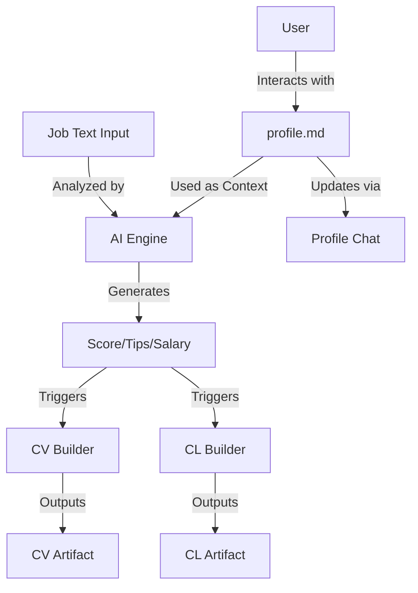

# Artemis Quiver - Job Hunting Automation Engine

## Overview
This app, called artemis quiver, will have the following flow:
User pastes a job posting to the chatbox and the app reviews it, compares it to the $user's profile and outputs:
- **Scoring**: A percentage match for the position (100% = perfect fit).
- **Recommendations**: Salary range and short tips for the application.
- **Focused CV**: Recommendations on CV optimizations and a button to go to the CV builder.
- **Cover letter**: A short draft of a cover letter and a button to go to the Cover Letter builder.

The app should have a sidebar where they can see their previous chats, in case they want to ask follow-up questions about any position.
The sidebar will also include a "you" section, which includes:
- **Profile**: A section where the user can upload CVs/files as context. Files are stored locally and scanned to update a master `.md` file. The user can view and edit this `.md` file and chat with an AI to optimize it.
- **CV Builder**: Generates an ideal CV based on job requirements or the master profile. Includes interactive chat for modifications and PDF download.
- **CL builder**: Generates a cover letter focused on a specific job or generic. Includes interactive chat and PDF download.
- **Config**: Configuration for API keys (Anthropic, Gemini, etc.) and LLM providers (OpenRouter, LMStudio).

## Project Plan

### App Summary
Artemis Quiver is an AI-driven job hunting engine that automates the comparison between a user's professional profile and specific job postings. It provides instant scoring, actionable application tips, and generates optimized CVs and cover letters via interactive AI chat sessions.

### Core Features
* **Job Analysis Engine**: Input job descriptions $\rightarrow$ Output Score (%), Salary Range, Interview Tips.
* **Profile Management**: A central `.md` "Master Profile" that evolves through file uploads and chat-driven updates.
* **Interactive Builders**: Chat-based modification for CVs and Cover Letters with PDF export capability.
* **Session History**: Sidebar navigation to revisit previous job analyses and follow up on interview preparations.
* **LLM Orchestration**: Configurable interface for OpenRouter, LMStudio, or direct Anthropic/Gemini integration.

### Recommended Tech Stack
* **Framework**: Next.js (App Router)
* **Styling**: Tailwind CSS + shadcn/ui
* **AI Layer**: Vercel AI SDK + OpenRouter / LMStudio
* **PDF Generation**: `react-pdf` or `jspdf`
* **Data Persistence**: Local filesystem (Markdown files for profile and session history).

### Pages & Routes
* `/` : **Analysis Hub** (Main chat interface for pasting job posts).
* `/profile` : **Profile Workspace** (View/Edit `.md` master file, upload context).
* `/cv-builder` : **CV Studio** (Generate and refine CVs).
* `/cl-builder` : **CL Studio** (Generate and refine Cover Letters).
* `/config` : **System Settings** (API keys and provider setup).
* **Sidebar**: Links to History, Profile, Builders, and Config.

### Data Model (Entity Relationship)

### Build Phases
1. **Phase 1: Infrastructure & Core AI**: Setup Next.js, shadcn/ui, and the AI SDK integration with OpenRouter/LMStudio.
2. **Phase 2: The "Source of Truth"**: Implement the Profile Engine (reading/writing `profile.md` and basic file parsing).
3. **Phase 3: Analysis Pipeline**: Build the job analysis logic (parsing input $\rightarrow$ generating score/tips).
4. **Phase 4: Artifact Generators**: Develop the CV and Cover Letter builders with chat-based refinement and PDF export.
5. **Phase 5: UI Shell & History**: Finalize sidebar navigation, session history persistence, and configuration page.

### Risks & Edge Cases
* **Context Overflow**: Large uploaded files/CVs may exceed LLM token limits; requires chunking or summarization logic.
* **Hallucination Risk**: AI might misinterpret job requirements or invent non-existent skills in the profile.
* **Parsing Failures**: Inconsistent formatting in user-uploaded text could break the extraction engine.
* **API Latency**: High-latency providers (OpenRouter) may cause UI freezing; requires robust streaming and loading states.
