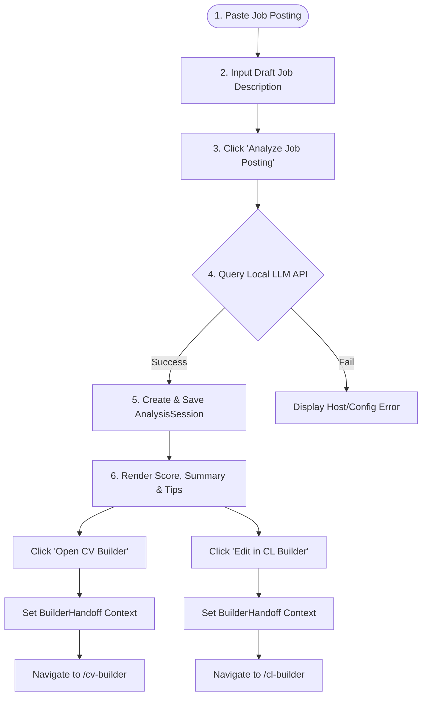

# 🔍 Analysis Hub

The **Analysis Hub** is the gateway interface of Artemis Quiver, allowing users to parse, score, and evaluate job postings against their active master profile.

---

## 🛠️ User Workflow Flowchart

The following diagram illustrates how the Job Analysis flow processes user inputs and coordinates handoffs to other systems:

---

## 🧱 Key UI Elements

Located in [AnalysisHub.tsx](file:///F:/Dev/Artemis_Quiver/src/app/pages/AnalysisHub.tsx):

### 1. Session Navigation (Sidebar)
Session loading is handled exclusively via the **sidebar's "Recent Analyses" section**. Clicking a past session calls `loadSession(id)` which restores the full analysis result (score, tips, recommendations, cover letter draft). There is no dropdown on the Analysis Hub page — the sidebar is the single source of truth for session selection.

### 2. Collapsible Prompt View
When viewing a past analysis result, a **collapsible card** at the top shows the analyzed job posting text:
- Default state: compressed (`max-h-20`, scrollable, mostly hidden)
- Click to expand: shows full text up to `max-h-[500px]` with scrollbar
- Click again to collapse
- Text is read-only in a monospaced `<pre>` block

### 3. Job Input Field & Button
- When no result is loaded, a multi-line `<Textarea>` is shown for job descriptions.
- The **Analyze Job Posting** button initiates the `analyze()` method from `AnalysisContext`.

### 4. Match Score Circular Indicator
- Displays the match score (0–100%) dynamically inside an SVG circular progress meter.
- Categorizes scores into badges:
  - `80% - 100%`: **Strong Match** (blue/green accent)
  - `60% - 79%`: **Good Match**
  - `40% - 59%`: **Moderate Match**
  - `0% - 39%`: **Stretch Role**

### 5. CV & Cover Letter Handoff Triggers
- **CV Optimization Card**: Lists 3-5 suggestions for improving the resume. Two buttons:
  - "Edit Profile" — navigates to `/profile` to update the master profile
  - "Generate CV with Recommendations" — passes `jobPosting` + `cvRecommendations` + `autoGenerate: true` to CV Builder via `BuilderHandoffContext`, then navigates to `/cv-builder`. The CV Builder auto-generates the CV on mount.
- **Cover Letter Card**: Renders the raw letter output. The "Edit in Builder" button transfers the letter draft to `BuilderHandoffContext` and redirects to `/cl-builder`.
