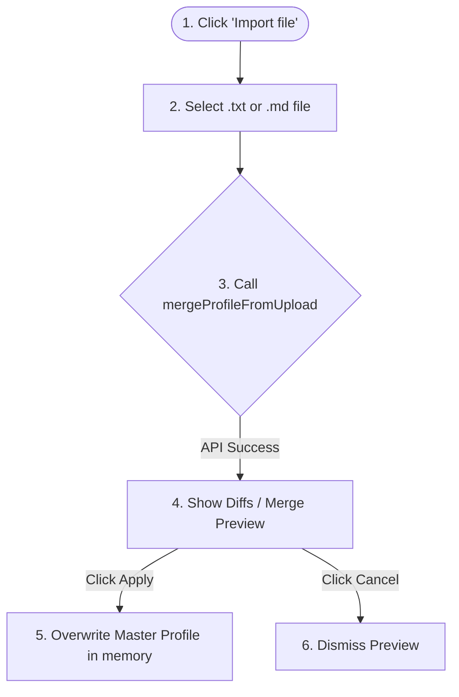

# 👤 Profile Workspace

The **Profile Workspace** allows users to edit and manage their master professional profiles. The master profile serves as the source of truth that all job analysis scoring and document generation builders refer to.

---

## 🔁 User Flow: File Import & Merge

Artemis Quiver allows importing `.txt` and `.md` resume files. Instead of overwriting existing content blindly, it feeds both files to the local LLM to do a factual, smart merge:

---

## 🧱 Key Features & Controls

Located in [Profile.tsx](file:///F:/Dev/Artemis_Quiver/src/app/pages/Profile.tsx):

### 1. Markdown Editor & Preview Tab
- **Edit Mode**: Standard markdown-formatted text editor `<Textarea>` for direct profile customization.
- **Preview Mode**: Renders the raw text layout safely.
- **Autosave**: If configured in settings, edits trigger an autosave to `localStorage` debounced at 800ms.
- **Dirty State**: Shows an indicator (`unsaved changes`) if memory deviates from local storage.

### 2. Smart File Importer
- Supports uploads up to **500KB**.
- Queries [profileMergeService.ts](file:///F:/Dev/Artemis_Quiver/src/app/services/profileMergeService.ts) to merge data without hallucinating experience.
- Renders a preview block showing the merge output for user verification prior to applying.

### 3. Profile AI Assistant Tab
- Side-by-side chat interface built on [profileChatService.ts](file:///F:/Dev/Artemis_Quiver/src/app/services/profileChatService.ts).
- Chat history is stored in the workspace database (`profileData.profileChat`) and persisted per-profile.
- **Apply to Editor Button**: The assistant can output blocks prefixed with `UPDATED_PROFILE:`. The page automatically extracts this markdown and offers a quick "Apply to editor" button that updates the main editor directly.
